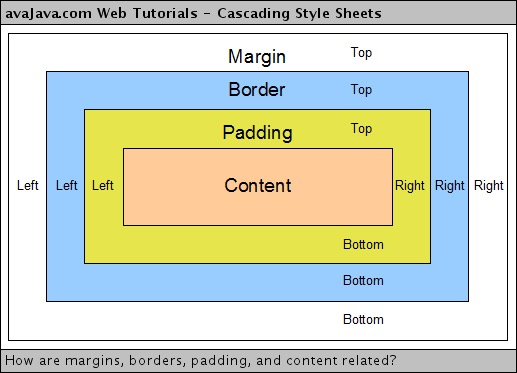

# 들어가기 앞서
## 절대경로와 상대경로 차이 알기
- 절대경로<br>
/(slash) : 루트 디렉토리를 기준으로 이동<br>
ex) 여기서는 24-2_FRONT가 root가 되어 기준이 됨 
    
- 상대경로<br>
./ : 현재 위치를 기준으로 이동<br>

- 상위 폴더<br>
../ : 현재 위치의 상위 폴더로 이동

<br>
<br>

# CSS
cacading style sheets<br>
- html에 스타일을 표현하게 해주는 언어<br>

## 인라인 스타일(inline style)
태그에 직접적으로 스타일을 입히는 방식 태그에 style이라는 속성을 통하면 구현가능<br>

## 내부 스타일 방식(internal sytle)
html 문서 내부에 style 태그를 사용하여 스타일 지정<br>

- 우선순위 : 인라인 스타일 > 내부 스타일

* 번외
 head 태그 내부에 style 태그를 정의<br>
    - head 태그 : 브라우저가 사용하는 정보
    - body 태그 : 사용자가 보는 정보

*차이 비교해보기*<br>
- 적용시점 : 헤드 태그에 있는 스타일은 페이지가 로드될 때 즉시 적용
바디 태그에 있는 스타일은 해당 요소가 렌더링된 후에 적용되므로, 스타일 변화가 눈에 띄게 지연
- 관리 용이성 : 헤드가 전체 스타일을 한 곳에서 정리할 수 있어 더욱 편리
- 재사용성 : 헤드는 여러 페이지에 동일하게 적용가능하지만 바디는 특정 요소에 국한됨

## 외부 스타일 방식(external style)
html 문서와는 별개의 파일에서 스타일을 지정하는 방법<br>
스타일을 한 번에 작성해 여러 html문서 적용할 수 있어 유지보수에 용이<br>

### 실습
 * .css 확장파일을 만들고 link 태그로 연결<br>
    ` <link rel = "stylesheet" href="./styel.css> ` <br>
    head 태그 내부의 style 태그를 지우고 link태그를 통해 css파일을 연결<br>

### 색상 정의
- RGB : 0부터 255까지로 색감을 조절
- HEX CODE : 256개 즉 16의 제곱의 경우의 수를 가짐
<br>
<br>
<br>
<br>

## 추가 공부

### margin


#### margin의 기본 개념
* 정의: margin은 요소의 외부 공간을 정의하며, 다른 요소와의 간격을 조절
* 속성:
    - margin-top: 위쪽 여백
    - margin-right: 오른쪽 여백
    - margin-bottom: 아래쪽 여백
    - margin-left: 왼쪽 여백
    - margin: 네 방향 여백을 한 번에 설정할 수 있는 단축 속성
<br>
<br>

* margin의 값
    - 픽셀(px): 고정된 크기 지정
    ```css
        margin: 20px;                    /* 모든 방향에 20px 여백 */
        margin: 10px 20px 10px 20px;     /* 각각 위쪽 오른쪽 아래쪽 왼쪽*/
    ```

    - 백분율(%): 부모 요소의 너비에 대한 비율로 지정
    ```css

    margin: 10%;        /* 모든 방향에 부모 너비의 10% 여백 */
    ```
    - 자동(auto): 자동으로 여백을 설정하여 중앙 정렬 등에 사용
    ```css

    margin: auto;       /* 수평 중앙 정렬 */
    ```

<br>
<br>
<br>

* margin collapse
margin collapse: 인접한 블록 요소의 수직 여백이 겹쳐지는 현상. <br>
ex) 두 개의 인접한 블록 요소가 각각 margin-bottom과 margin-top을 가질 때, 이 두 여백이 합쳐져서 더 큰 여백으로 나타날 수 있음
<br>
<br>

* 예제
```
.box {
  margin: 20px;            /* 모든 방향에 20px 여백 */
}

.box-top {
  margin-top: 10px;       /* 위쪽에 10px 여백 */
}

.box-left-right {
  margin: 0 15px;         /* 위아래는 0, 좌우는 15px 여백 */
}

.box-auto {
  margin: auto;           /* 자동 여백으로 중앙 정렬 */
}
```
<br>
<br>
<br>

### padding

* 개념<br>
padding은 요소의 내용(텍스트, 이미지 등)과 요소의 경계(테두리) 사이의 공간을 의미<br>
이 공간을 조절하여 내용을 더 깔끔하게 표현<br>

* 다양한 패딩 설정
    - 개별 방향 설정
    ```css

    .box {
    padding-top: 10px;      /* 위쪽에 10px 패딩 */
    padding-right: 20px;    /* 오른쪽에 20px 패딩 */
    padding-bottom: 30px;   /* 아래쪽에 30px 패딩 */
    padding-left: 40px;     /* 왼쪽에 40px 패딩 */
    }
    ```
    <br>
    <br>

    - 한 번에 설정하기
     ```css

    .box {
    padding: 10px 20px; /* 위/아래 10px, 좌/우 20px */
    }
    ```


    * 모두 다르게 설정하기
    ```css

    .box {
    padding: 10px 20px 30px 40px; /* 위 10px, 오른쪽 20px, 아래 30px, 왼쪽 40px */
    }
    ```
